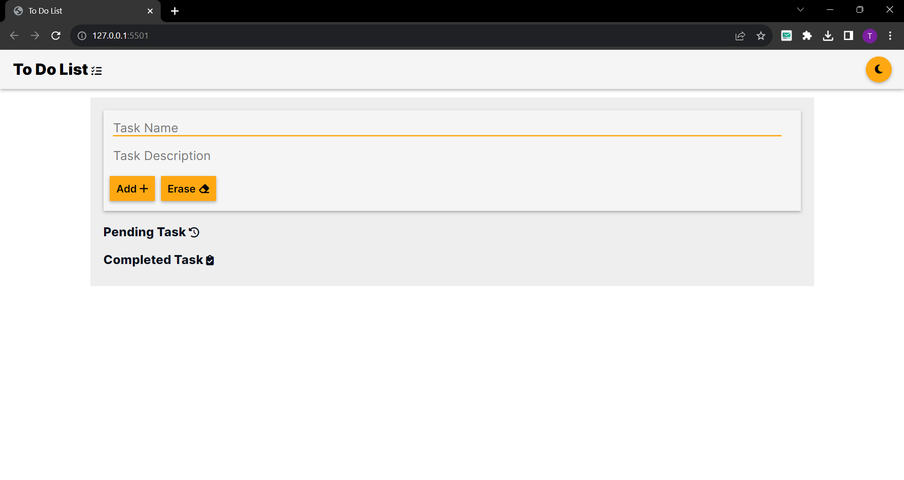
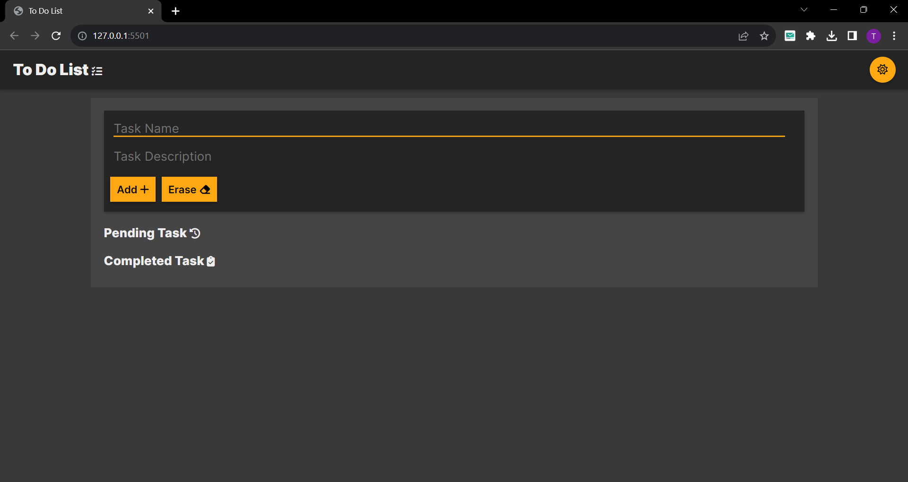
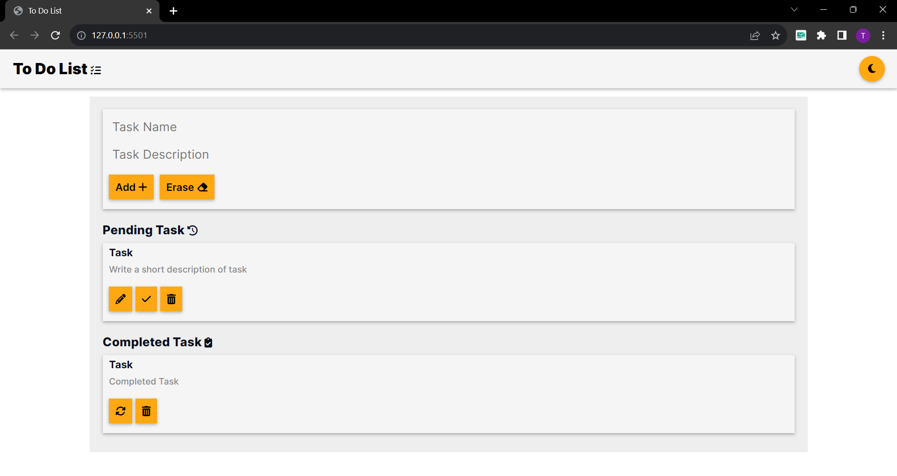

# To-Do-List
This lightweight and user-friendly TodoList application was made using only HTML, CSS, and pure JavaScript. Task management becomes easier with local storage support because it keeps track of your tasks even when the browser is closed. It is simple and straightforward to add, update, and remove jobs using this user-friendly interface.

## Check the project Live here.
Project Link - https://tarunchoudhary3884.github.io/To-Do-List/

## Key Features:
- **Pure JavaScript Implementation:** The TodoList is built entirely using JavaScript, making it efficient and easy to maintain.

- **Local Storage Support:** Enjoy the benefits of data persistence with local storage. Your tasks will be saved, allowing you to resume your work seamlessly.

- **Task Management Made Easy:** Add, edit, and remove tasks effortlessly through a clean and intuitive user interface.

## Getting Started:

1. Visit the live demo [here](https://tarunchoudhary3884.github.io/To-Do-List/) or clone the repository to your local machine git clone `https://github.com/tarunchoudhary3884/To-Do-List.git`.
2. Open `index.html` in your preferred web browser.
3. Start managing your tasks efficiently!

## Images:

## Demo:
Check out demo video to see the TodoList in action:

https://github.com/tarunchoudhary3884/To-Do-List/assets/85241851/5c0eb0f1-c229-47bc-a318-9262ce91711f

